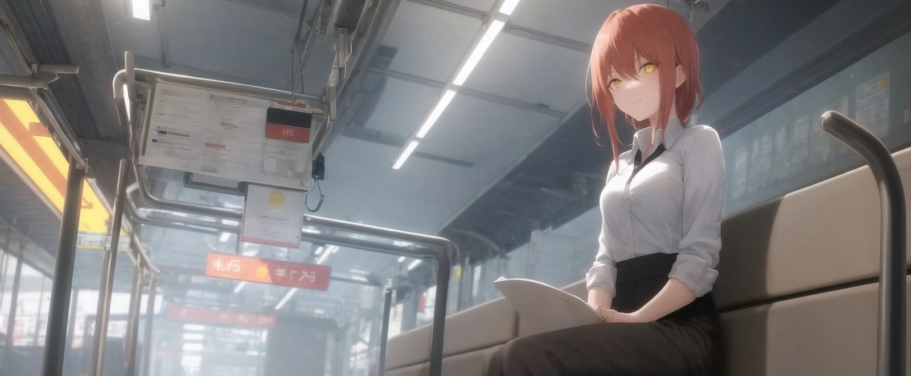
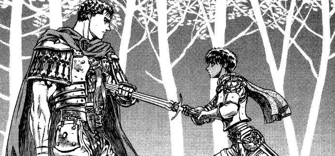
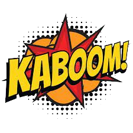

# Planet Shibuya

## ¿En qué consiste mi proyecto?

<!-- Enlaces de Bibiografía -->

[Akira Cómics](https://www.akiracomics.com/) [Anime Tracker](https://troubled-mascara-1b7.notion.site/5d305bd9b176414bbf95744d4fa4e788?v=c76a71dcb17146b096fe40b58a47da8d&pvs=4)

El objetivo del proyecto es proporcionar al público interesado en el mundo de los cómics y el manga un servicio que unifique en una sola aplicación web herramientas que les permita de una forma atractiva tener un seguimiento de los mangas y cómics que han leído, organizándolos por puntuación, género y/o otras etiquetas personalizadas y comprar otros nuevos con una sola cuenta.

### ¿Qué diferencia a mi proyecto de otras propuestas similares?

Mientras que es posible que en otras partes encuentras servicios que quizás te permitan tener control de tu biblioteca, de tus lecturas o listas de pendientes, o comprar un tomo nuevo, estas aplicaciones son de propósito específico y si quieres complementar una actividad con la otra necesitas usar varias diferentes.

Lo cierto es que a nadie le gusta tener que crearse decenas de cuentas y llenar su dirección de correo electrónico de "newsletters" y spam.

Esto sin embargo no será necesario con nuestra aplicación pues bajo un mismo "portal" podremos acceder a todas esas funciones con unos pocos clicks.

## Funciones previstas

- Suscribirte a una colección que esté en emisión de forma que cada vez que salga un nuevo tomo o grapa te llegue a casa sin hacer nada más.
- Hacer un seguimiento de tus lecturas y lecturas pendientes de forma que lo puedas organizar por géneros, demografía, puntuación e insertarles imágenes personalizadas para facilitar su localización.
  
 

## Justificación de colores

Debido a que nuestro público objetivo de nuestro servicio son los lectores, generalmente de cómics y manga, y los telespectadores de anime o películas de superheroes y otros géneros de ciencia ficción.

ROJO: #801515

Teniendo esto en cuenta hemos decidido usar paletas de colores fácilmente reconocible para nuestros usuarios. Tonalidades de rojo, fuertes y llamativas como Marvel, el amarillo y/o dorado de las onomatopeyas típicas del medio, o los blancos y negros propios de los manga.

BLANCOS Y NEGROS:

· Blanco: FFFFFF

· Gris: 706B5F

· Negro: 000000

Y por último, para contrastar, añadir detalles y alguna cosa más, se aprovecharía esa paleta de amarillos tan típica de las onomatopeyas.

AMARILLO: FFBA20

